<div align="center">

# blank

**Point it at a Git repository. Get back one HTML file that explains the codebase.**

Hotspots, temporal coupling, knowledge risk, activity — computed from history and content,
rendered into a single self-contained page you can email, commit, or drop in a bucket.

[](https://github.com/nikhilcherry/blank/actions/workflows/ci.yml)
[](https://www.python.org/downloads/)
[](LICENSE)
[](pyproject.toml)

</div>

<p align="center">
  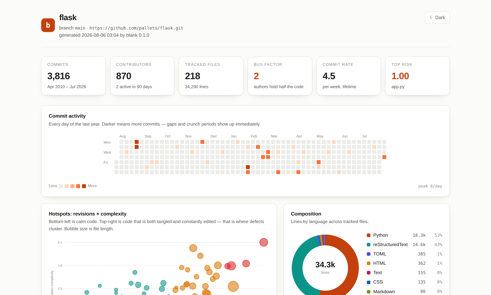
</p>

```bash
blank scan ~/code/flask --open
```

That's the whole workflow. No config file, no database, no account, no network call.

---

## Why

Every repository has files that everyone is quietly afraid of. They are rarely the biggest
files, and they never show up in a linter. They are the files that are **both** tangled
**and** touched constantly — and the intersection is where defects actually cluster.

`blank` finds that intersection, and four other things a `git log` will not tell you:

| Question | What `blank` shows |
| --- | --- |
| *Which files are actually dangerous?* | Risk ranking — revisions × complexity, not size |
| *What breaks when I change this?* | Temporal coupling — files that always change together |
| *Who do we lose if someone leaves?* | Bus factor and per-file ownership |
| *What has nobody understood in years?* | Orphaned hotspots — risky code whose only author left |
| *Is this project healthy or crunching?* | A year of commit activity, at a glance |
| *Is it getting better or worse?* | `blank diff` between any two reports |

Everything is derived from data you already have. Nothing is uploaded anywhere.

---

## Install

```bash
pipx install git+https://github.com/nikhilcherry/blank     # provides the `blank` command
```

Or run it straight from a clone — there is nothing to build:

```bash
git clone https://github.com/nikhilcherry/blank
cd blank
python3 -m blank stats ~/code/some-repo
```

> Not on PyPI yet. Once it is published, `pip install blank-report` will work too — the
> package name is reserved in [`pyproject.toml`](pyproject.toml).

**Requirements:** Python 3.9+ and `git`. That's it. `blank` has **zero** third-party
dependencies — no numpy, no jinja, no charting library. The entire tool is the standard
library plus about 2,000 lines of Python.

---

## Usage

```
blank scan [PATH]        write a self-contained HTML report
blank stats [PATH]       print a summary in the terminal
blank hotspots [PATH]    rank files by revisions × complexity
blank authors [PATH]     contribution breakdown
blank coupling [PATH]    files that change together
blank check [PATH]       fail a build when thresholds are crossed
blank diff OLD.json NEW.json   compare two reports and show what moved
```

`scan` writes HTML by default, and can emit JSON (`--json`) and Markdown (`--markdown`)
in the same pass — pass `-` to any of them for stdout.

Every command accepts the same window flags:

| Flag | Effect |
| --- | --- |
| `--since DATE` | Only commits after `DATE` — anything git parses (`2024-01-01`, `18 months ago`, `1.year`) |
| `--max-commits N` | Stop after N commits, newest first |
| `--include-merges` | Count merge commits (off by default — they double-count changes) |
| `--no-color` | Plain output for logs and pipes (also honours `NO_COLOR`) |

### In the terminal

```bash
blank stats ~/code/flask
```

<p align="center">
  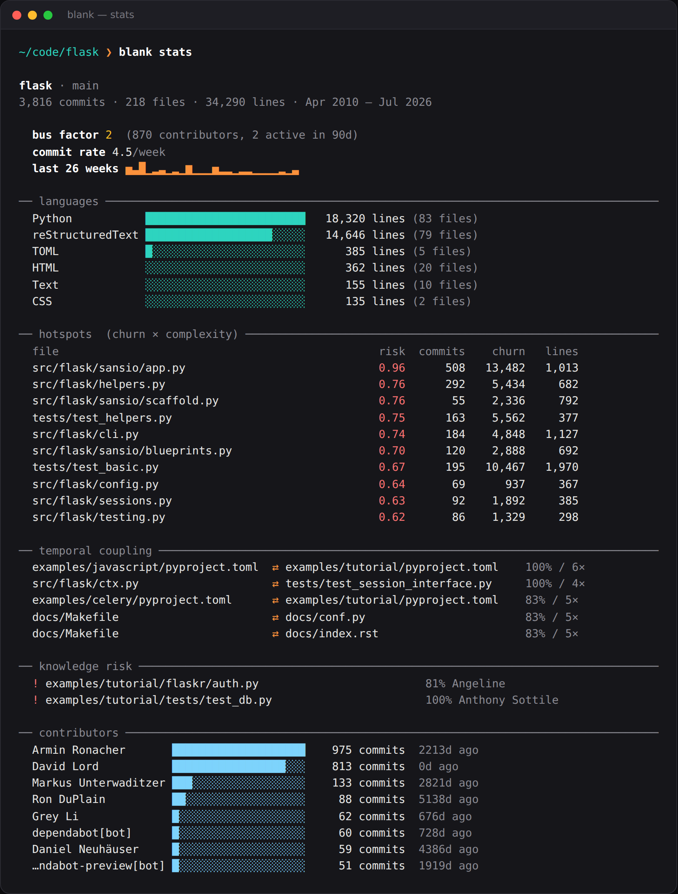
</p>

Colour switches itself off when stdout is not a TTY, so piping into a file stays clean.

---

## What's in the report

### Hotspots: revisions × complexity

<p align="center">
  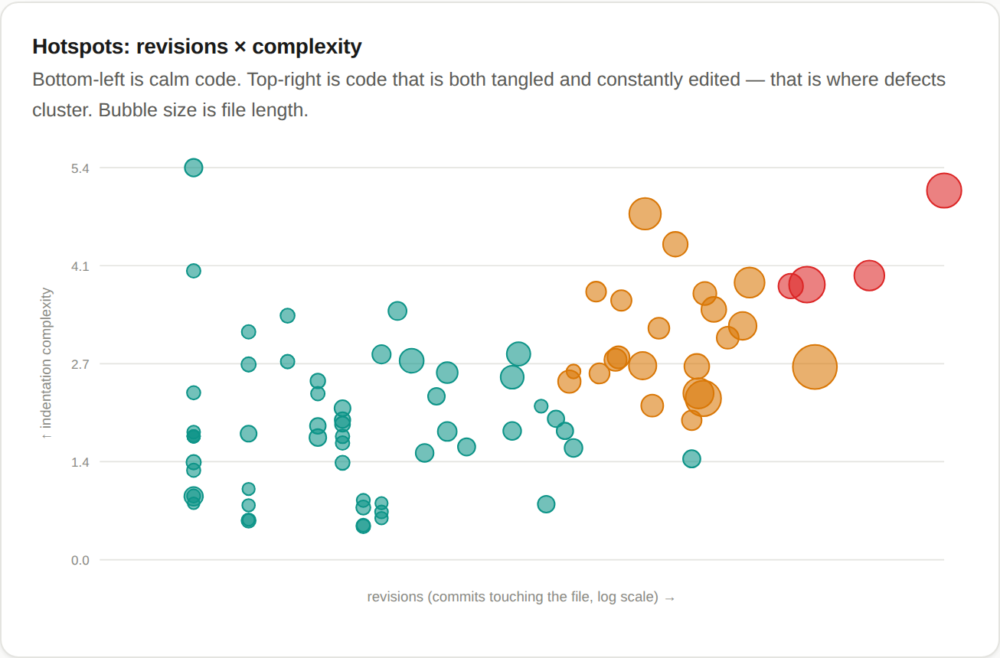
</p>

Each bubble is a file. Right means "revised often". Up means "deeply nested". Bubble size is
length. **Bottom-left is calm code. Top-right is where your incidents come from.**

Complex code that nobody touches is fine — leave it alone. Simple code that changes daily is
fine too — that's just an active module. The product of the two is the signal, and it is the
one metric here that reliably predicts where the next bug lands.

Change frequency is counted in **revisions, not lines changed**. Lines-changed looks like the
obvious choice and is a trap: a file's very first commit adds every line it has, so in a young
repository "churn" is just file length in disguise, and a fresh import reports every file as a
screaming hotspot. Revisions can't be inflated that way. Both axes are log-normalised to 0..1
before multiplying.

<p align="center">
  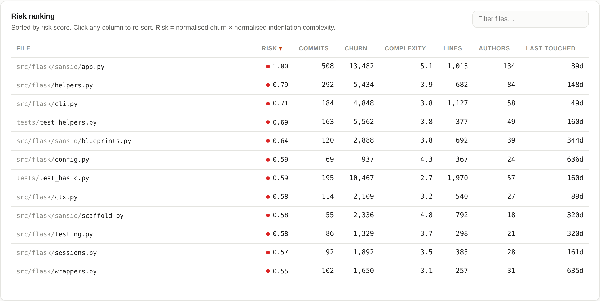
</p>

The table is sortable and filterable — click any column, type to narrow. It's plain
JavaScript embedded in the page; it works offline from a `file://` URL.

### Temporal coupling

<p align="center">
  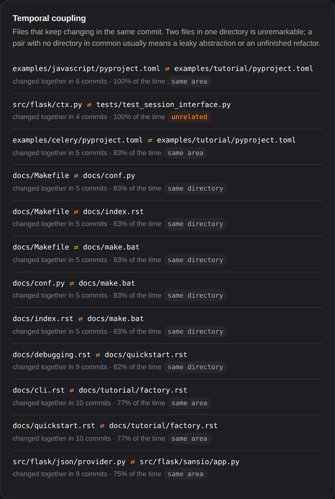
</p>

Files that keep appearing in the same commit are coupled whether or not they import each
other. Each pair is labelled by how far apart the files sit:

| Label | Means | Reading |
| --- | --- | --- |
| `same directory` | Same folder | Unremarkable — siblings change together |
| `same area` | Share a parent, different folders | Worth a glance |
| `unrelated` | No directory in common | The finding: a leaking abstraction, or a refactor that stopped halfway |

The obvious version of this test — compare the first path segment — is wrong in both
directions. A file at the repository root has its *own filename* as the first segment, so
`flag_groups.go` and `flag_groups_test.go` come out "cross-module"; on cobra that mislabels
22 of 40 pairs. Meanwhile `examples/javascript/x` and `examples/tutorial/y` share a segment
and come out "same module" despite being unrelated applications. Comparing directories fixes
both.

Commits touching more than 40 files are excluded — a formatting sweep would otherwise
"couple" your entire repository to itself.

### Knowledge risk

<p align="center">
  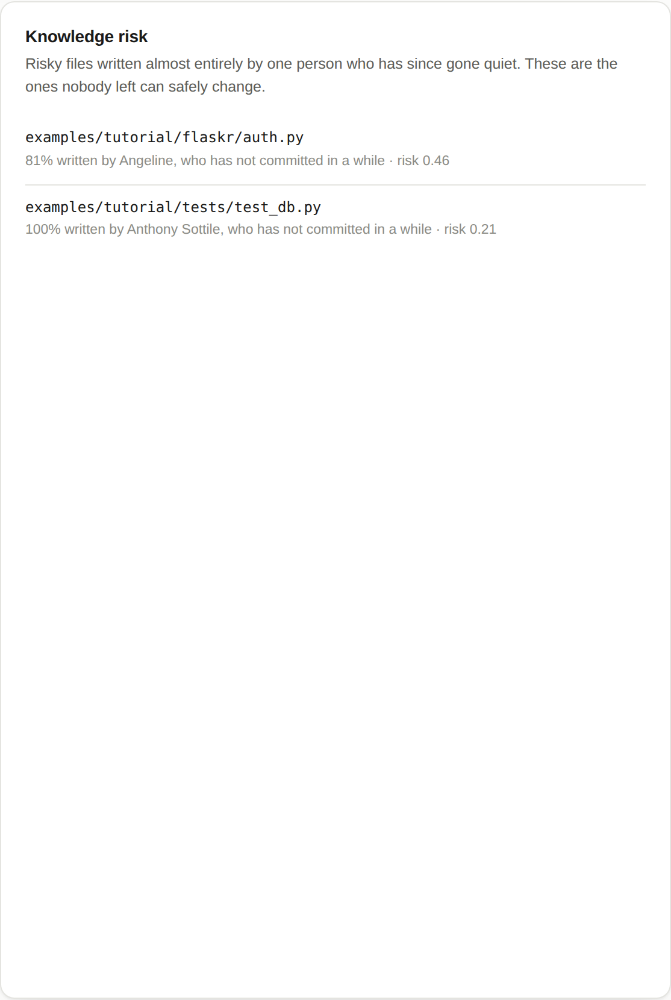
</p>

The intersection nobody tracks: a file that is **risky**, **written ≥80% by one person**, and
**that person hasn't committed in six months**. These are the files where the next change is
going to be archaeology.

### Composition and layout

<p align="center">
  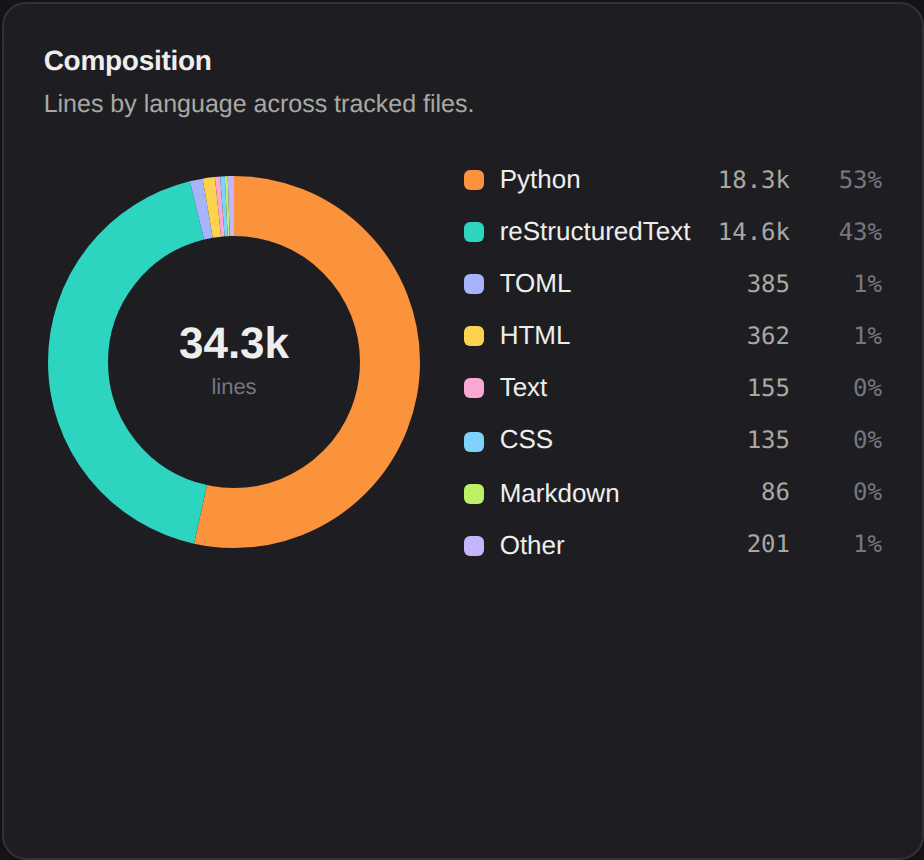
  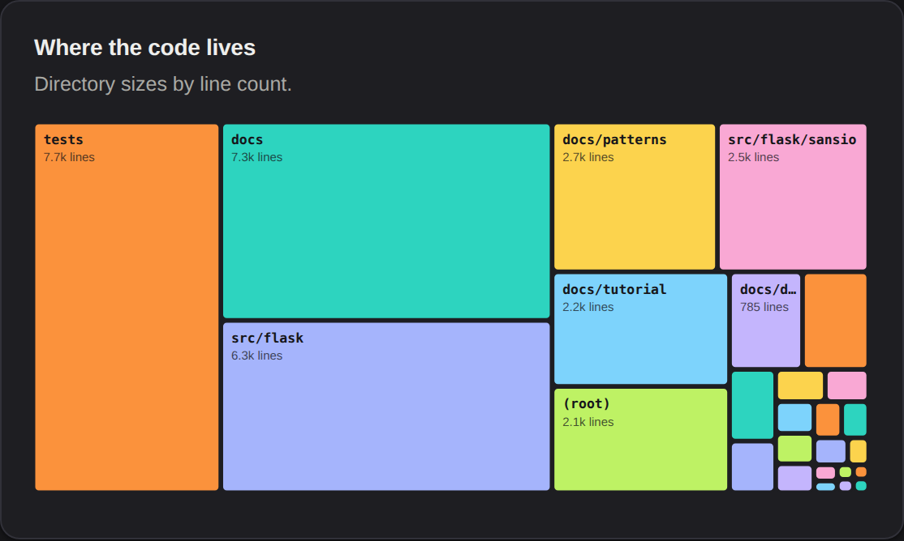
</p>

Language mix, and a squarified treemap of where the lines actually live. Useful for the
"wait, our tests are bigger than our source" moment.

### Activity

<p align="center">
  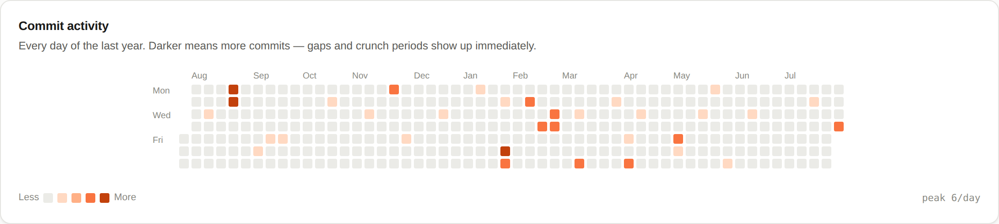
</p>

A year of daily commits. Sustained weekends and month-long silences both show up instantly.

### Light and dark

<p align="center">
  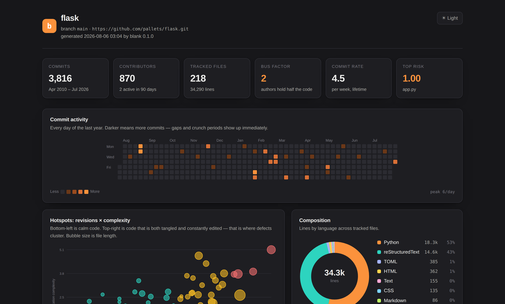
</p>

The page follows your system preference and remembers the toggle. Both themes ship in the
same stylesheet — there is no second build, and no flash on load.

**Try the real thing:** [live report for pallets/flask](https://claude.ai/code/artifact/ddfb5aeb-04ba-4727-8906-bcb3428f6b7d)
— the actual file `blank scan` wrote, sortable and filterable. Or the
[full-page screenshot](docs/img/report-full.png).

---

## Use it in CI

`blank check` turns the analysis into a build gate. It exits `1` when a threshold is
crossed, `0` when clean, and `2` when you forgot to give it any thresholds.

```bash
blank check . --max-risk 0.85 --min-bus-factor 2 --max-orphans 5
```

<p align="center">
  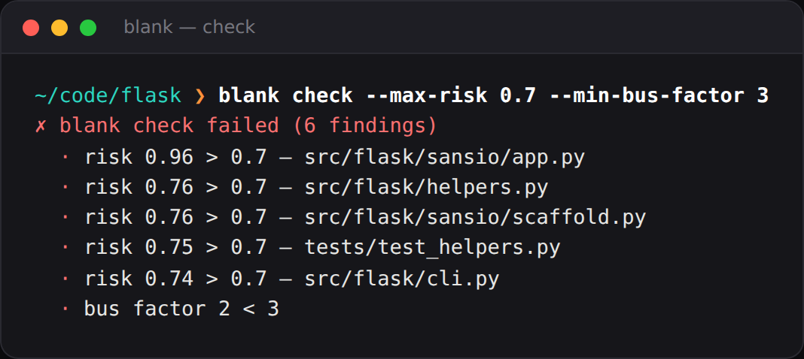
</p>

### The bundled Action

`blank` ships its own composite action, so the whole thing is four lines:

```yaml
# .github/workflows/health.yml
name: Code health
on: [push, pull_request]

jobs:
  blank:
    runs-on: ubuntu-latest
    steps:
      - uses: actions/checkout@v4
        with:
          fetch-depth: 0          # blank needs history — a shallow clone has none

      - uses: nikhilcherry/blank@main
        with:
          max-risk: "0.9"
          min-bus-factor: "2"

      - uses: actions/upload-artifact@v4
        with:
          name: blank-report
          path: blank-report.html
```

It writes the Markdown summary straight to the job summary page, so the numbers are on the
run itself — no artifact to download to see them.

| Input | Default | Does |
| --- | --- | --- |
| `path` | `.` | Repository to analyse |
| `since` | *(all)* | Restrict the history window |
| `report` | `blank-report.html` | HTML output path; empty disables |
| `json` | `blank-report.json` | JSON output path; empty disables |
| `summary` | `true` | Write Markdown to `$GITHUB_STEP_SUMMARY` |
| `max-risk` | *(off)* | Fail above this risk score |
| `min-bus-factor` | *(off)* | Fail below this bus factor |
| `max-orphans` | *(off)* | Fail above this many orphaned hotspots |

Outputs `report`, `json`, `bus-factor` and `top-risk` for later steps to consume.

> [!IMPORTANT]
> `fetch-depth: 0` is not optional. The default shallow checkout has one commit, every
> history-derived metric reads as zero, and `blank` will warn you about exactly this.

### Markdown anywhere else

```bash
blank scan . -o /dev/null --markdown - > summary.md      # or pipe into a PR comment
blank scan . -o /dev/null --markdown "$GITHUB_STEP_SUMMARY"
```

<details>
<summary>What the summary looks like</summary>

```markdown
## `flask` — code health

**3,816** commits · **218** files · **34,290** lines · **870** contributors · bus factor **2** ⚠️

### Top risks

| File | Risk | Revisions | Complexity | Lines | Authors | Last touched |
| --- | ---: | ---: | ---: | ---: | ---: | ---: |
| `src/flask/sansio/app.py` | 🔴 1.00 | 508 | 5.1 | 1,013 | 134 | 89d |
| `src/flask/helpers.py` | 🔴 0.79 | 292 | 3.9 | 682 | 84 | 148d |
| `src/flask/cli.py` | 🔴 0.71 | 184 | 3.8 | 1,127 | 58 | 49d |

### Files that change together

- `src/flask/ctx.py` ⇄ `tests/test_session_interface.py` — 100% of the time (4 commits) — **cross-module**
```

</details>

### Machine-readable output

```bash
blank scan . -o /dev/null --json - | jq '.hotspots[:3]'
```

Progress messages go to stderr, so stdout is nothing but the payload and pipes cleanly.

```json
[
  {
    "path": "src/flask/sansio/app.py",
    "risk": 1.0,
    "commits": 508,
    "churn": 13482,
    "complexity": 5.089,
    "lines": 1013,
    "authors": 134,
    "main_author": "David Lord",
    "ownership": 0.275,
    "days_since_change": 89
  }
]
```

The JSON carries `summary`, `languages`, `hotspots`, `coupling`, `authors` and
`knowledge_risk`.

---

## Watching it move

One report tells you where a codebase stands. Two tell you which direction it's heading,
which is the more actionable question. `blank diff` compares any two JSON reports:

```bash
blank scan . -o /dev/null --json baseline.json     # keep this as a CI artifact
# ...three months later...
blank diff baseline.json current.json
```

<p align="center">
  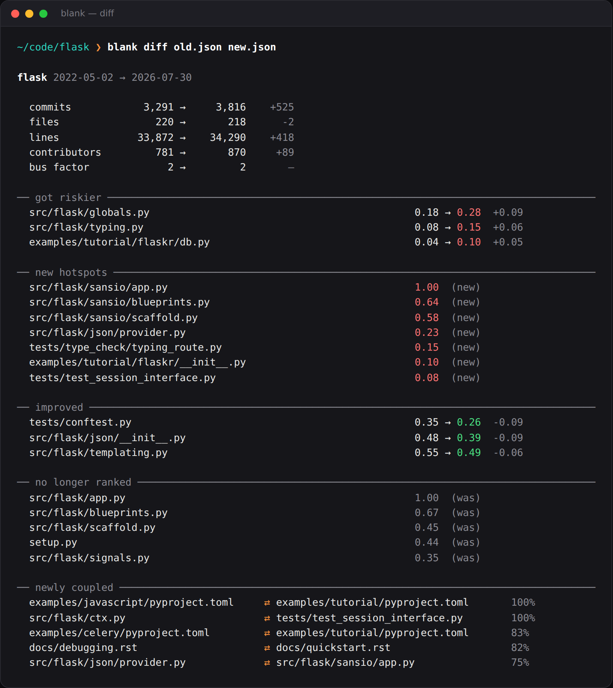
</p>

That's Flask across 525 real commits, and it tells the story correctly: `src/flask/app.py`
drops out of the ranking at 1.00 while `src/flask/sansio/app.py` appears at 1.00 — the
`sansio` refactor, visible as a shape in the data.

Nothing is re-analysed, so a baseline is just a small JSON file you keep around. Moves
smaller than `0.05` are suppressed as noise (`--floor` to change it), because risk is a
*relative* score and tiny wobbles are files entering and leaving the normalisation set.

### Gate a pull request on it

```bash
blank diff baseline.json current.json --max-increase 0.15   # exit 1 if risk jumps
blank diff baseline.json current.json --fail-on-regression  # exit 1 on any increase
blank diff baseline.json current.json --markdown - >> "$GITHUB_STEP_SUMMARY"
```

Without a gate flag, `diff` always exits `0` — it reports, it doesn't judge.

> [!NOTE]
> Two independent analyses can't see across a rename, so a moved file shows up as one
> entry under *no longer ranked* and another under *new hotspots*. That's deliberate:
> guessing which new path replaced which old one would invent facts.

---

## How the metrics work

Every number here is a **proxy**. They are worth arguing with — which is why the definitions
live in exactly one file, [`blank/analyze.py`](blank/analyze.py).

**Revisions** — how many commits touched the file, following renames so a `git mv` doesn't
reset a file's history to zero. This is the change-frequency axis.

**Churn** — lines added + deleted. Reported in the table and the JSON as supporting detail,
but deliberately *not* used for ranking, for the reason above.

**Complexity** — mean nesting depth + 0.35 × max depth. This is an *indentation proxy*, not
an AST metric. It cannot tell a nested comprehension from a nested `if`. What it can do is
work identically across 40 languages with no parser, and deeply indented code is genuinely
harder to hold in your head regardless of syntax. Files under 5 code lines score 0.

Depth is counted in **nesting levels, not columns**, with the indent unit detected per file
from the most common step between consecutive lines. A fixed four columns would be wrong for
most of the web: Go and Rust indent in fours, but JavaScript, TypeScript and Ruby indent in
twos, so a fixed divisor halves their depth and rounds one level of nesting to zero — and in
a polyglot repo the Python would outrank the JavaScript no matter how tangled the JavaScript
got. Measured across cobra, ripgrep and express, detection picks 4, 4 and 2 for 194 of 196
files.

**Risk** — `normalise(revisions) × normalise(complexity)`, both `log1p`-scaled to 0..1 across
the repository. It is a *relative* ranking: 0.9 means "worst in this repo", not "worse than
some industry threshold". Comparing scores between two different repositories is meaningless.

Files revised fewer than twice score 0 — created-and-never-touched is zero evidence, not low
risk. `blank` refuses to present a ranking built on nothing, and says which of the two
causes it is:

```
── hotspots  (revisions × complexity) ──────────────────────────────
  thin history — no file has been revised since it was created,
  so the ranking below is noise (wait for more history)
```

The second cause is subtler and more dangerous: a `--since` window narrow enough that most
files were touched once or never. The repository plainly *has* history, so nothing looks
wrong — but the ranking is resting on a handful of files:

```
$ blank stats ~/code/flask --since "6 months ago"
── hotspots  (revisions × complexity) ──────────────────────────────
  thin history — only 9 of 110 code files have been revised more than
  once since 6 months ago, so the ranking below is noise (widen the window)
```

The threshold is grounded rather than guessed. With full history, real repositories score
80–100% of their code files (flask 83%, django 80%, express 94%, cobra 100%, ripgrep 87%).
Flask over six months scores 8% — and six months is also the shortest window whose
top-ranked file stops agreeing with the full-history answer.

**Coupling ratio** — `commits containing both / commits containing the rarer of the two`.
Reported at ≥4 shared commits and ≥35%.

**Bus factor** — the fewest authors whose combined lines-added cover half the codebase. It
measures *authorship*, not *understanding*: a team that reviews everything is far more
resilient than this number suggests, and a team that rubber-stamps is less.

**Ownership** — one author's share of the lines added to a file. Bulk commits (>40 files)
are excluded so a repo-wide reformat doesn't hand one person the whole codebase.

### What it deliberately does not do

- **No AST parsing.** Real cyclomatic complexity would need a parser per language. The
  indentation proxy correlates well enough to rank files, which is all that's needed here.
- **No blame-based ownership.** `git blame` over every file is minutes of work for a
  marginally better number. `blank` uses lines-added per author instead, and finishes a
  4,000-commit repository in about two seconds.
- **No judgement about tests.** A high-churn test file is often a *good* sign. Non-code
  files (Markdown, JSON, YAML, config) are counted in the composition charts but excluded
  from risk ranking, so a busy CHANGELOG never tops the list.

---

## Performance

Single pass over `git log --numstat`, one `os.walk`, everything else in memory.

| Repository | Commits | Files | Time | Peak RSS | Report size |
| --- | ---: | ---: | ---: | ---: | ---: |
| pallets/flask | 3,816 | 218 | 1.7 s | 98 MB | 105 KB |
| django/django | 34,856 | 5,553 | 34 s | 399 MB | 218 KB |

Measured, not estimated. The interesting part is the breakdown on Django:

```
git log            29.3 s     ← git walking 35k commits
parse               0.7 s
follow renames      0.1 s
scan tree           0.9 s
coupling            0.4 s
```

**`blank` is git-bound, not compute-bound.** Roughly 86% of a large run is `git log`
itself computing diffs; everything blank does on top costs about two seconds. Rename
detection (`-M`) is free — with and without it, git takes the same 29 seconds.

So the lever is the history window, not the tool:

```bash
blank scan . --since "18 months ago"     # usually the more useful report anyway
blank scan . --max-commits 5000
```

A shorter window is often *better*, not just faster: last year's hotspots tell you where
the work is now, while a decade of history mostly tells you which files are old.

Memory scales with commit count, since the parsed history is held at once — budget a
~50 MB baseline plus roughly 10 MB per thousand commits, and reach for `--since` somewhere
past 50k.

---

## Development

```bash
git clone https://github.com/nikhilcherry/blank && cd blank
python3 -m unittest discover -s tests -t . -v     # 151 tests, no dependencies
python3 -m blank scan . --open                    # run it on itself
```

The layout:

| File | Does |
| --- | --- |
| [`blank/gitlog.py`](blank/gitlog.py) | Runs `git log`, parses `--numstat`, follows renames |
| [`blank/scan.py`](blank/scan.py) | Walks the tree: languages, line counts, indentation |
| [`blank/analyze.py`](blank/analyze.py) | Every metric definition, in one place |
| [`blank/charts.py`](blank/charts.py) | Server-rendered SVG: heatmap, donut, treemap, scatter |
| [`blank/render.py`](blank/render.py) | Assembles the HTML, JSON and Markdown reports |
| [`blank/compare.py`](blank/compare.py) | Diffs two JSON reports — what got riskier, what improved |
| [`blank/term.py`](blank/term.py) | Terminal output: colour, bars, sparklines |
| [`blank/cli.py`](blank/cli.py) | Argument parsing and command dispatch |

Charts are generated as SVG strings in Python, not drawn by JavaScript. That is why the
report opens instantly, works offline, prints correctly, and stays around 110 KB for a
4,000-commit repository.

Contributions welcome — especially better language detection, and a smarter complexity proxy
that stays parser-free.

---

## License

MIT — see [LICENSE](LICENSE).

<div align="center">
<sub>Screenshots generated from <a href="https://github.com/pallets/flask">pallets/flask</a>, 3,816 commits.</sub>
</div>
